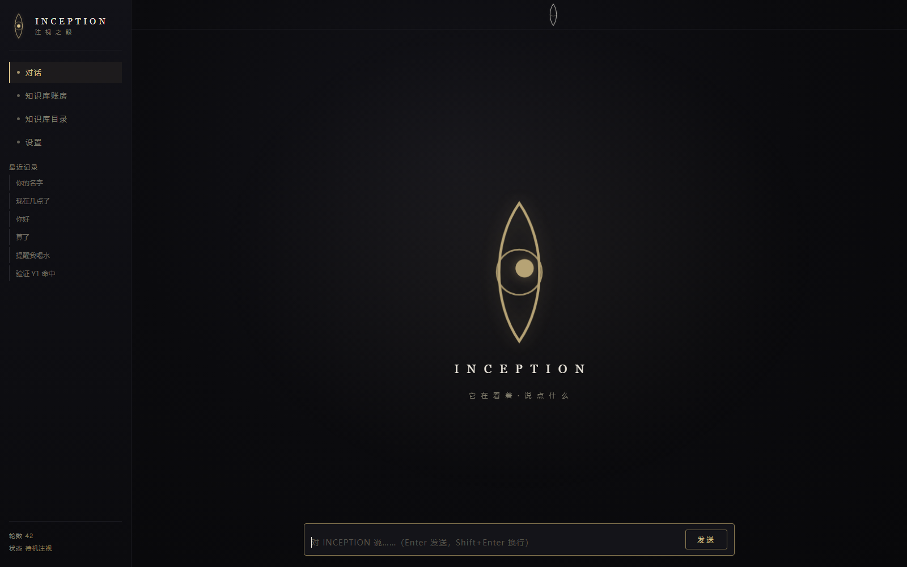
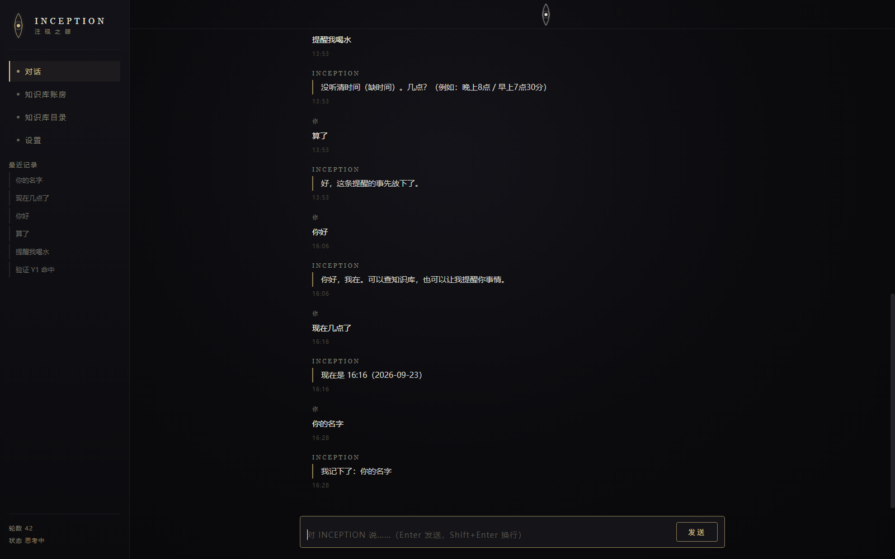
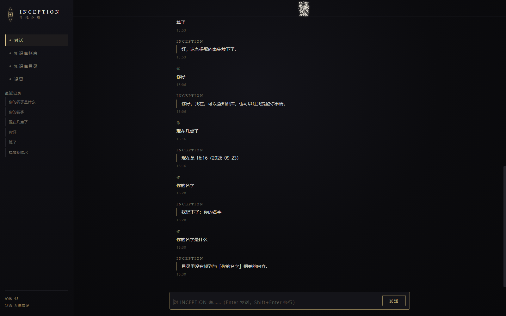
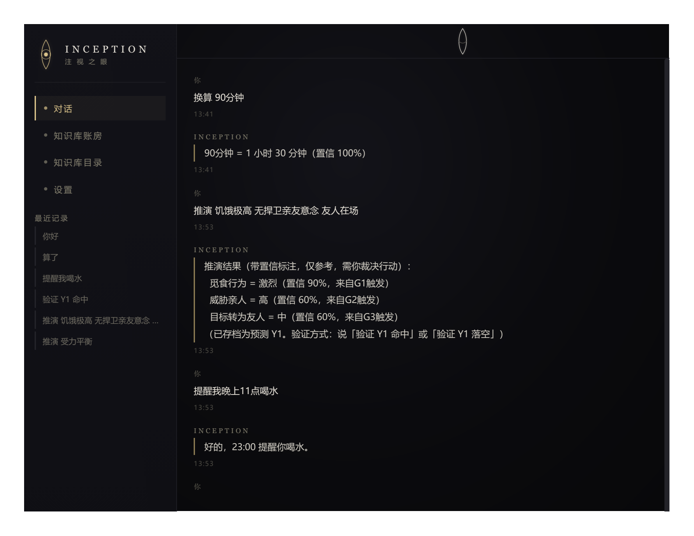

# INCEPTION

> 基于AI辅助生成的个人灵感设计项目(设计人工，代码AI辅助)
> 这是一个个人灵感设计项目：设计由我产出，代码由 AI 辅助生成。因我尚未系统学习 AI 与编程知识，项目目前处于封存状态。回顾设计时我发现，许多想法在历史上已有前人探索且未能走通——但我很高兴，在那一刻我独立抵达了他们曾经到达的地方，并试图带着他们的问题继续往前走。

---

一个自设计的「统计感知 + 符号思考 + 神经提炼」混合架构 AI 本体与配套三区知识库系统——个人学习实验项目，公开用于交流与获取反馈。

> 本仓为**设计与实现的公开副本**：代码、施工规格书、全部变更报告与验证脚本、知识库常识条目。
> 运行数据（对话记录、任务档案、操作日志、申请记录）按隐私边界未收录。
> 施工唯一依据是 `AI/AI规格书.md`：左栏设计者原话（带归属标签），右栏工程落地；先改文档再改代码，全部变更留痕（变更 #1–#32 见登记册与报告）。

## 界面实拍（2026-09-23 构建）

中央那只眼睛是系统状态的化身：**待机时淡金色注视一切；对话开始眼睛隐去、在对话框上沿睁开表示运行中；无任务时闭合；系统错误时碎裂成发光碎片缓慢消散。**

| 待机 · 中央注视 | 运行 · 上沿睁眼 | 错误 · 碎裂消散 |
|:---:|:---:|:---:|
|  |  |  |

对话与推演实拍——推演输出强制带置信标注与来源，行动由人裁决：



## 目录结构

```
├── 00-使用说明与注意事项（先读我）.md   ← 总登记册：全部变更的活记录
├── AI\
│   ├── AI规格书.md                      ← 设计规格（设计者原话逐字对照 + 归属标签）
│   ├── brain\                           ← AI 大脑六层包：语言/解析/注意力/推演/执行/学习
│   └── inception\                       ← INCEPTION 桌面壳（眼睛界面）
├── 知识库\
│   ├── kb\                              ← 三区知识库服务（FastAPI：存储/审批/审计/备份/限流）
│   ├── static\                          ← 管理界面 / 目录界面 / 聊天界面
│   └── data\                            ← 三区常识条目（信任区/存疑区/待审核区）
├── 报告\                                ← 变更报告 / 审查报告 / 验证脚本 / 界面实拍 / 历史备份
└── 启动INCEPTION.py / 启动服务.py / 管理菜单.py
```

## 运行

```bash
pip install -r 知识库/requirements.txt
python 启动服务.py        # 知识库服务 127.0.0.1:8320
python 启动INCEPTION.py   # 桌面壳
```

首启后用 `知识库/admin_cli.py` 生成管理员密钥与 AI 密钥（密钥不落本仓：默认读 `D:\机密\`，可用环境变量 `CANGKU_SECRET_DIR` 改址；脚本读 `CANGKU_ADMIN_KEY`）。知识库未启动时 AI 也能聊（断连降级，本地功能照常）。

## 设计要点

- **思想自由，行动受控，全程留痕**：推演不设阀门，输出强制带置信标注，执行只过白名单；
- **三区知识库**：分区=确定性程度（信任区=已证明/存疑区=能用未证/待审核区=申请候着），一切知识变更走 REQ 申请→人类裁决→哈希链留痕；
- **经验提炼**：矿工从任务档案里挖共现/捷径/趋同/数值趋同/语词共现规律，候选附证据进建议队列等人裁决；
- **能力三阶段**（初级→进阶动态权重→最终全域打分）与放权路径见 `AI/AI规格书.md` 第 10 节。

欢迎 Issue/Discussion 提反馈与建议。
